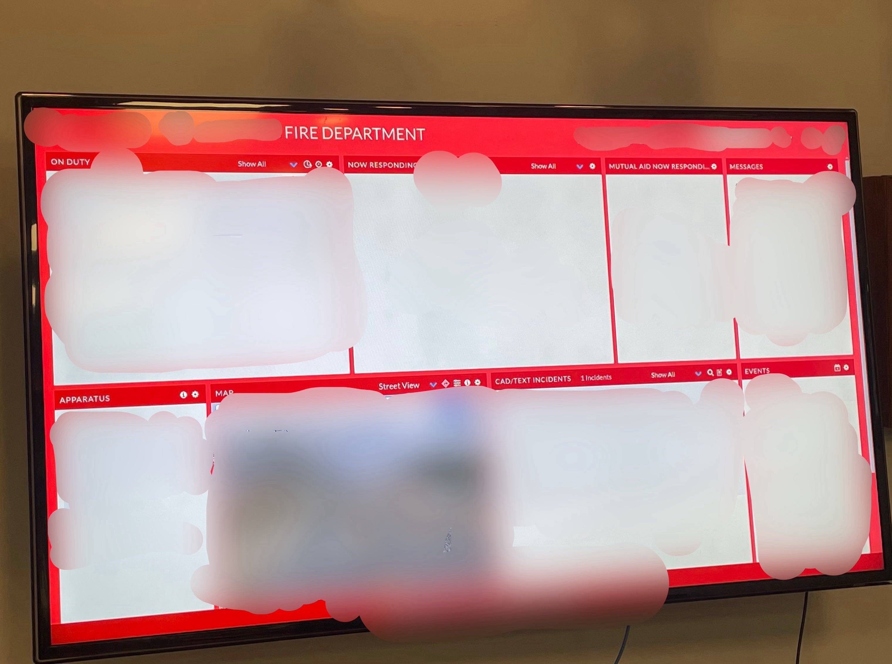
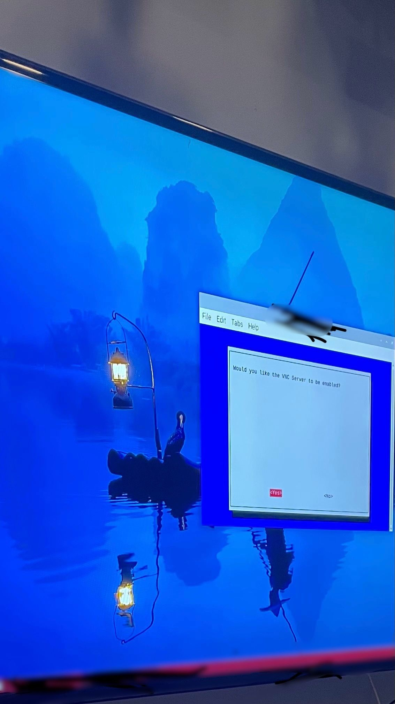

# secure-emergency-alert-display
Secure Raspberry Pi alert display using VNC with TLS encryption, SSH tunneling, kiosk mode configuration, and network traffic validation using Wireshark. Built to safely display emergency alerts while maintaining strong cybersecurity controls.

## **Project Overview**
This project enhances the security, reliability, and usability of an emergency alert display system. A Raspberry Pi was configured as a secure, headless alert display, using encrypted VNC sessions, SSH tunnels for remote access, TLS-protected communication, and Wireshark to validate network security. Additional system-level hardening ensured the display boots directly into kiosk mode with minimal user interaction.

## **Key Activities Completed**
- Configured VNC server with TLS encryption
- Implemented SSH tunneling to secure VNC traffic over untrusted networks
- Set up kiosk-mode autostart for emergency alert dashboard
- Secured Raspberry Pi & Mac OS communication paths
- Validated network performance and display reliability
- Documented protocols, ports, and security configurations
- Conducted system-level verification after deployment

## **Screenshots**

### **1. Emergency Alert Dashboard Display**
Final emergency alert dashboard shown on the display after securing the Raspberry Pi. The screen confirms the successful kiosk-mode configuration and encrypted remote-access setup.

### **2. Network Traffic & Encryption Validation**
Captured network traffic used to verify TLS/SSH encryption. The step ensured VNC traffic and alert data were securely transmitted without exposing sensitive information.

### **3. SSH Tunnel + Remote Management Setup**
Remote administration of the Pi over an encrypted SSH tunnel. This demonstrates secure headless access, used to manage VNC, system services, and security configurations.

### **4. Enabling VNC Server for Secure Access**
Enabling and securing the VNC server on the Raspberry Pi. Used to configure encrypted communication for the emergency alert display and enforce secure remote access. 

## **Tools & Techniques**
- **Cybersecurity & Encryption**
    - TLS-encrypted VNC communication
    - SSH tunneling for remote access
    - Wireshark packet inspection
- **System Administration**
    - Raspberry Pi OS configuration
    - Secure remote management
    - Autostart & kiosk-mode setup
- **Network Configuration**
    - Port configuration & tunnel hardening
    - Verifying secure communication channels
    - Headless access configuration
- **Reliability & Deployment**
    - Automated boot-to-dashboard
    - System performance validation
    - Stable operation in emergency environment

    ## **Purpose**
    The purpose of this project was to secure an emergency alert display system by combining encryption, tunneling, and validated network traffic protections. The result is a locked-down, reliable alert display suitable for critical, alway-on operational environments such as emergency services.

